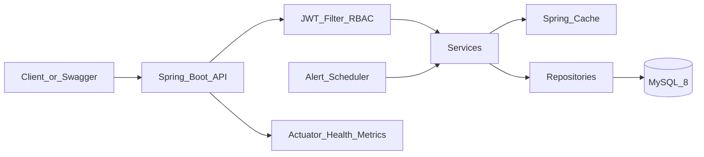
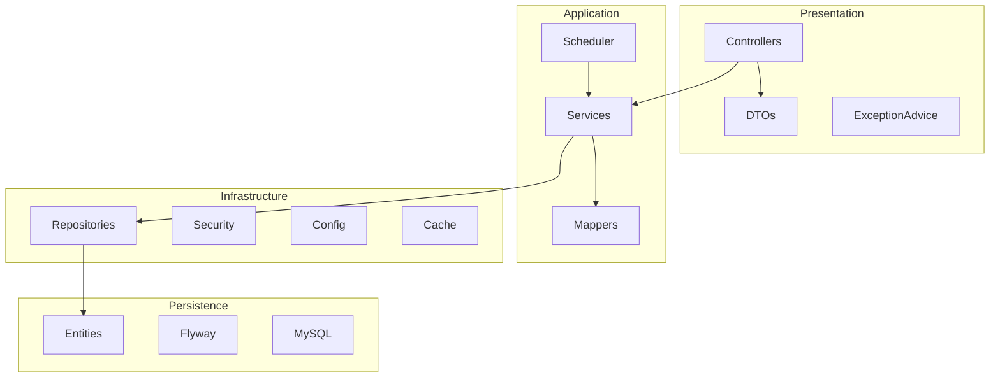
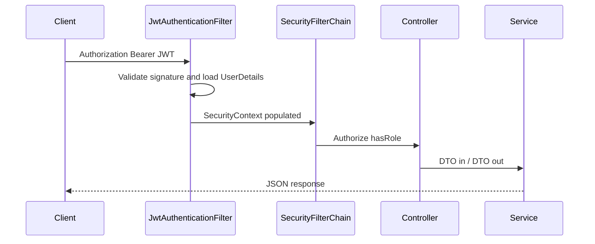
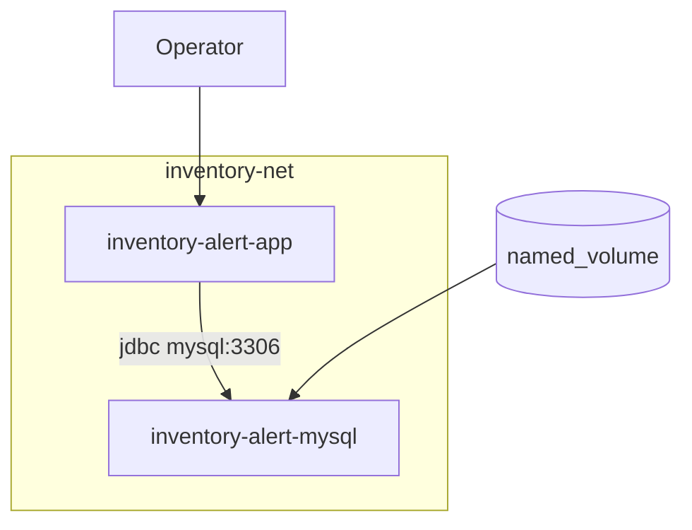

# Architecture

## Runtime context

```mermaid
flowchart LR
  Client[Client_or_Swagger] --> API[Spring_Boot_API]
  API --> Security[JWT_Filter_RBAC]
  Security --> Services[Services]
  Services --> Cache[Spring_Cache]
  Services --> Repos[Repositories]
  Repos --> MySQL[(MySQL_8)]
  Scheduler[Alert_Scheduler] --> Services
  API --> Actuator[Actuator_Health_Metrics]
```

## Layered package design

```mermaid
flowchart TB
  subgraph presentation [Presentation]
    Controllers
    DTOs
    ExceptionAdvice
  end
  subgraph application [Application]
    Services
    Mappers
    Scheduler
  end
  subgraph infrastructure [Infrastructure]
    Repositories
    Security
    Config
    Cache
  end
  subgraph persistence [Persistence]
    Entities
    Flyway
    MySQL
  end
  Controllers --> Services
  Services --> Repositories
  Services --> Mappers
  Scheduler --> Services
  Repositories --> Entities
  Controllers --> DTOs
```

## Auth request path

```mermaid
sequenceDiagram
  participant C as Client
  participant F as JwtAuthenticationFilter
  participant S as SecurityFilterChain
  participant Ctrl as Controller
  participant Svc as Service
  C->>F: Authorization Bearer JWT
  F->>F: Validate signature and load UserDetails
  F->>S: SecurityContext populated
  S->>Ctrl: Authorize hasRole
  Ctrl->>Svc: DTO in / DTO out
  Svc-->>C: JSON response
```

## Deployment (Compose)

```mermaid
flowchart TB
  subgraph dockerNet [inventory-net]
    App[inventory-alert-app]
    DB[inventory-alert-mysql]
  end
  User[Operator] --> App
  App -->|jdbc mysql:3306| DB
  Vol[(named_volume)] --> DB
```
